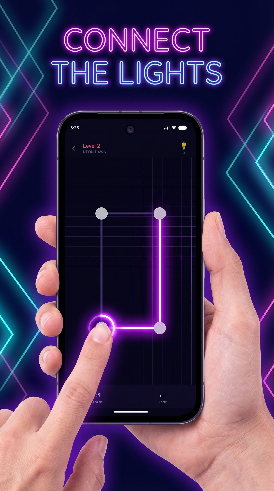
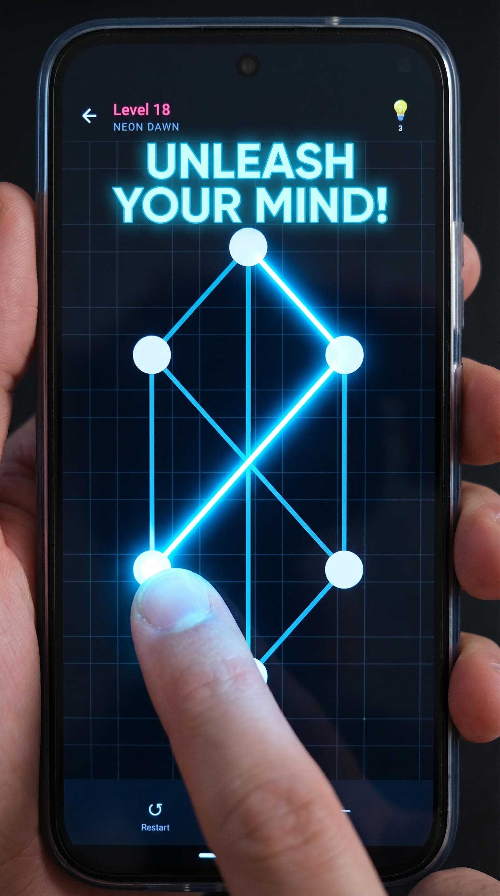
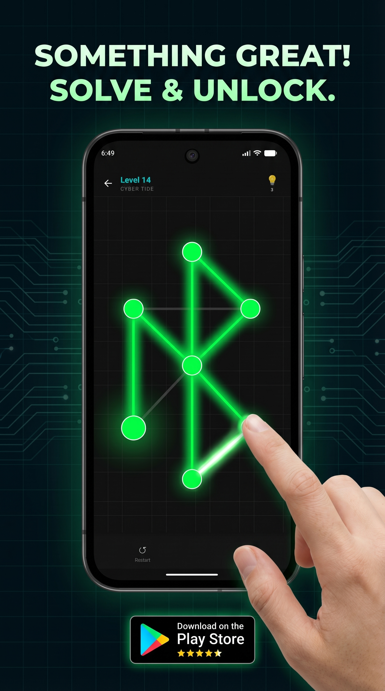

# 🎮 One Stroke – Minimalist Puzzle Game

[](https://mohit-gidwani.github.io/OneStroke-Public/)
[](https://buymeacoffee.com/flashconvert)

---

## 🤔 What is One Stroke?

**One Stroke** is a minimalist puzzle game where you **draw every edge exactly once without lifting your finger**. Inspired by the classic [Seven Bridges of Königsberg](https://en.wikipedia.org/wiki/Seven_Bridges_of_K%C3%B6nigsberg) problem, each level is a handcrafted graph puzzle waiting to be solved.

### 🎁 What It Contains

| 📦 Content | 🔢 Count | 📝 Description |
|------------|----------|----------------|
| **Handcrafted Levels** | 110 | Unique graph puzzles across 5 themed worlds |
| **Picture Puzzles** | Hidden | ⭐ Stars, 🏠 Houses, ❤️ Hearts & more shapes |
| **Star Rating System** | Per Level | 3-star rating — earn perfect score with zero undos |
| **Hint System** | Unlimited | Highlights valid moves, earn through gameplay |
| **Skins Collection** | Unlockable | Colorful node skins purchased with coins |
| **Offline Play** | 100% | No internet required (ads optional) |

---

## 📱 Screenshots

| 🏠 House Puzzle | 🌍 World Selection | 🔵 Circle Puzzle |
|:--:|:--:|:--:|
|  |  |  |

---

## ✨ Features

| Feature | Description |
|---------|-------------|
| 🧩 **110 Levels** | 5 neon worlds × 22 levels each |
| ⭐ **Star Rating** | Earn up to 3 stars — zero undos for perfect score |
| 💡 **Hint System** | Highlights valid moves, earn through play |
| 🎨 **Skins** | Unlock colorful node skins with coins |
| 🔊 **Sound & Haptics** | Satisfying audio feedback |
| 📴 **100% Offline** | No internet needed (except ads) |

---

## 🌈 5 Worlds to Conquer

```
┌─────────────────────────────────────────────────────────┐
│  ⚡ NEON DAWN  │  🌊 CYBER TIDE  │  🏆 GOLD RUSH         │
│     #FF2D78    │     #00FFFF     │     #FFE600           │
├─────────────────────────────────────────────────────────┤
│  🔥 INFERNO    │  🌌 VOID BREACH │                        │
│     #FF6B00    │     #BF00FF     │                        │
└─────────────────────────────────────────────────────────┘
```

| World | Color | Theme |
|-------|-------|-------|
| ⚡ **Neon Dawn** | `#FF2D78` | Pink/Red - Entry world |
| 🌊 **Cyber Tide** | `#00FFFF` | Cyan - Water themed |
| 🏆 **Gold Rush** | `#FFE600` | Yellow - Treasure hunt |
| 🔥 **Inferno** | `#FF6B00` | Orange - Fire challenges |
| 🌌 **Void Breach** | `#BF00FF` | Purple - Final mastery |

---

## 🎨 Brand Assets

| Asset | File | Dimensions |
|-------|------|------------|
| App Icon (512) | [`assets/icons/app-icon-512.png`](assets/icons/app-icon-512.png) | 512×512 px |
| Full Logo | [`assets/icons/app-logo.png`](assets/icons/app-logo.png) | 1457×1457 px |
| Feature Graphic | [`assets/store-listing/feature-graphic.png`](assets/store-listing/feature-graphic.png) | 1024×500 px |
| Promo Social | [`assets/store-listing/promo-social.png`](assets/store-listing/promo-social.png) | 1080×1920 px |

---

## 📦 Tech Stack

```
┌─────────────────────────────────────────────┐
│           🛠️ Built With                     │
├─────────────────────────────────────────────┤
│ 🟣 Kotlin                                   │
│ 🤖 Kimi K2.5                               │
│ 🧠 Claude Sonnet 4.6                       │
├─────────────────────────────────────────────┤
│ ⏱️ Built in: 3 Days                         │
└─────────────────────────────────────────────┘
```

---

## 📥 Download

| Platform | Status | Link |
|----------|--------|------|
| 🎮 **Google Play** | 🔄 In Review & Testing | *Coming Soon* |
| ☕ **Support** | ✅ Available | [Buy Me A Coffee](https://buymeacoffee.com/flashconvert) |

> 🚀 **Launching soon!** The app is currently in final review and testing stage.

---

## 📄 Legal

| Document | Link |
|----------|------|
| 🔒 Privacy Policy | [View Here](https://mohit-gidwani.github.io/OneStroke-Public/privacy.html) |
| 📋 Terms of Service | [View Here](https://mohit-gidwani.github.io/OneStroke-Public/terms.html) |
| 🌐 Website | [Visit](https://mohit-gidwani.github.io/OneStroke-Public/) |
